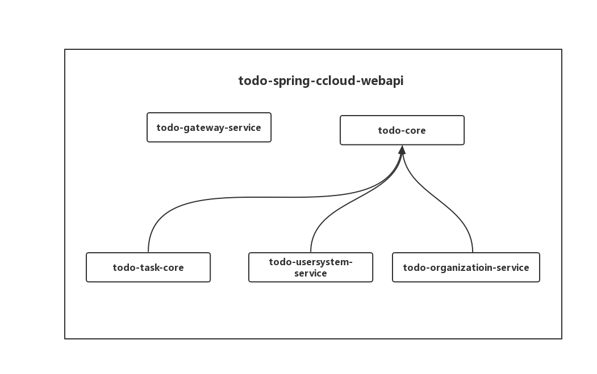

## 项目介绍

### 技术选型
- 服务注册与发现：nacos
- api网关服务：spring gateway
- 简化Domain类代码：lombox
- SSO：spring security+OAuth2+JWT
- api文档管理：swagger2
- 数据库：mysql，spring data jpa
- session同步 spring session 
### 系统功能
- 组织管理
- 部门管理
- 职位管理
- 人员管理
- 项目管理
- 任务管理
- 任务类型管理

### 项目结构
todo-spring-cloud-webapi/

| -- todo-gateway-service  //api网关服务

| -- todo-usersystem-service  //用户服务，包括用户，角色，分组等

| -- todo-task-service  //任务服务，如任务，任务分类，评论等

| -- todo-organization-service  //组织架构服务，包括，人员，职位，部门，组织等

### 模块依赖关系

## 开发环境
