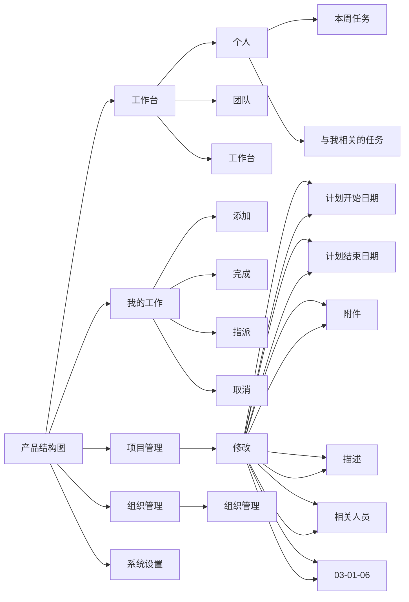

[TOC]

## 1.版本信息

| 版本号  | 修订人/审核人 | 修订日期 | 修订内容 |
| ------- | ------------- | -------- | -------- |
| V 1.0.0 | 石豪杰        | 编辑中   |          |
|         |               |          |          |

## 2.文档说明

### 2.1 文档简介

本文档主要描述 Todo 的功能需求点及其设计，目的在于清晰地定义各模块的需求细节及逻辑流程。

### 2.2 文档读者

本文档主要面向以下读者：Todo项目的研发人员、测试人员、以及后续维护人员等。

### 2.3 专业术语

无

## 3.产品简介

### 3.1 产品定位

主要关注于任务管理，只提供简单的项目新信息管理，如状态，时间，描述等，不过多关注项目过程。

### 3.2 产品特色

提供多种图表，月计划表，周计划表，日总结表，周总结表，月总结表等

### 3.3 用户分析

主要为普通员工提供计划安排，管理人员查看部门内人员工作基本情况

## 4.产品架构

## 5.详细功能说明
## 6.非功能需求
## 7.项目规划

